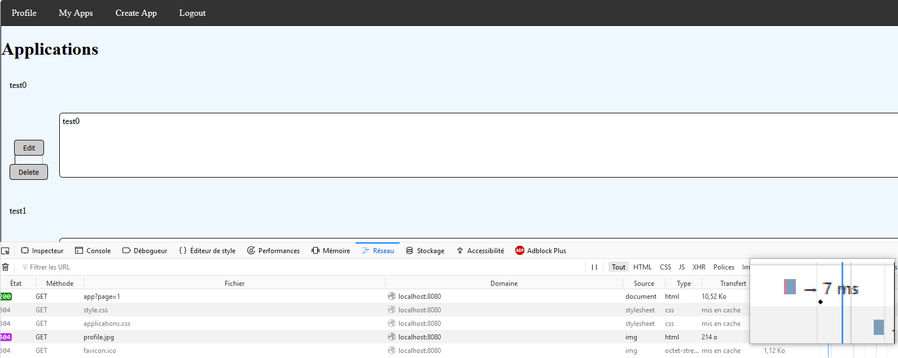
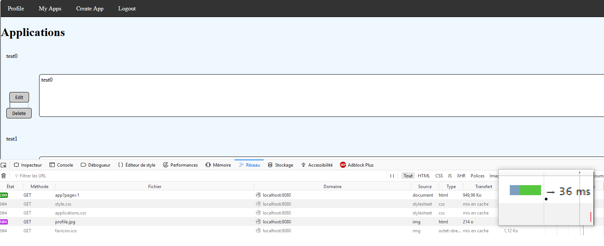

# Pagination

Our app allow users to add application and to see them on the screen.

This could lead to a problem if a user have thousands of applications. We use paginations to improve performance of the app and scalability.

We tried to do test using jmeters, but it didn't work because we didn't understand how to manage session (we keep getting rejected by the filter)

Anyway we did some test of performance with our browser and it seems pretty clear that the paginations increase it a lot.

Here are two screenshot where we can see the difference between the version with pagination and the other version when loading a page of apps of a user that have 1000 total apps : 

With pagination : 

Without pagination : 

For 1000 apps, the pagination is 7x faster than the other version.