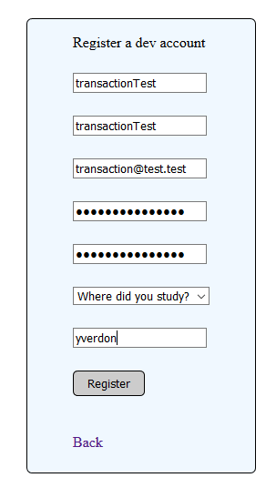
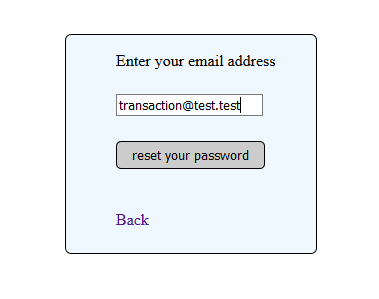
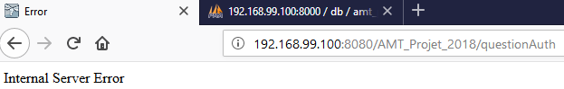
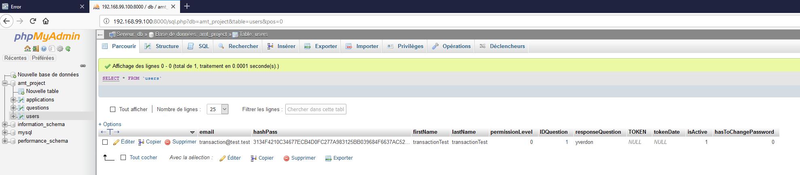
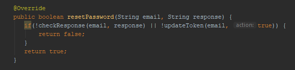
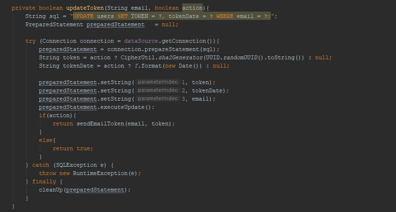

# Transaction test

To test the transaction roll back mecanism, we did the following test : 

1. We disable internet (the app run in localhost)

2. We register an account as follows : 

3. We ask to reset the password of the new user : 

4. The server throw an error, because we don't have internet, so he can't send an email to the user

5. We check in the DB with phpMyAdmin and we see that the token and token date field are not defined even if the requests have been made.
That's the case because we throw a new runtime exception when the email can't be send, and the server rollback the requests.

6. Here is the code that have been executed during the process : 

We see that we first check the response, and then we update the token.

The update token function is the following one : 

In this function we update the token in the database before sending the email. Any exception in the process causes the request to be rollbacked.

